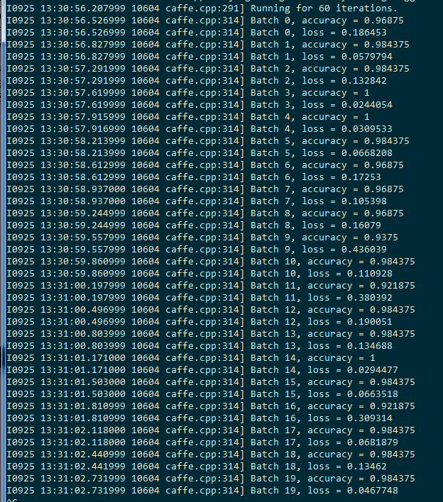

# 12306验证码训练集

## 图片和文字包含如下类别：

```
安全帽/  刺绣/    高压锅/  红豆/    开瓶器/  路灯/    盘子/    手掌印/  仪表盘/
本子/    打字机/  公交卡/  红酒/    口哨/    锣/      跑步机/  薯条/    印章/
鞭炮/    档案袋/  挂钟/    红枣/    蜡烛/    绿豆/    啤酒/    双面胶/  樱桃/
冰箱/    电饭煲/  锅铲/    护腕/    辣椒酱/  蚂蚁/    热水袋/  调色板/  雨靴/
菠萝/    电线/    海报/    话梅/    篮球/    毛线/    日历/    拖把/    蒸笼/
苍蝇拍/  电子秤/  海鸥/    剪纸/    老虎/    蜜蜂/    沙包/    网球拍/  中国结/
茶几/    订书机/  海苔/    金字塔/  铃铛/    棉棒/    沙拉/    文具盒/  钟表/
茶盅/    耳塞/    航母/    锦旗/    龙舟/    排风机/  珊瑚/    蜥蜴/    烛台/
创可贴/  风铃/    黑板/    卷尺/    漏斗/    牌坊/    狮子/    药片/
```

## caffe的测试效果：

